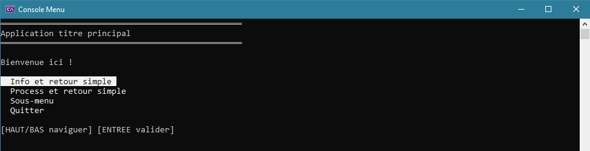

# ConsoleMenu

IHM réalisé en **C#** pour la **Console .NET 6** intégrant un **menu manipulable par les touches clavier Haut, Bas et Entrée**. 

Le menu conserve la position du **curseur** et **réécrit le texte** à chaque navigation. 
- Ceci évite le scintillement dû au rafraîchissement de la Console avec `Console.Clear()`. 
- Cela autorise des procédure de toutes sortes avant l'affichage du menu.

La classe IHM.cs présente une architecture de type : **une fonction par écran**. Chaque fonction affiche un titre, traite une procédure quelconque, puis appelle les éléments nécessaires pour afficher un menu.

Le menu est géré par la méthode `Menu()`. Les **options** du menu font l'objet d'une classe `Option` qui contient un titre `String` et une *delegate* `Action`, cette dernière servant de *callback* pour gérer le **parcours entre les écrans**.

Une variable `int` sert à **stocker le choix de l'utilisateur** à chaque utilisation des flèches Haut ou Bas. La valeur est réinitialisée à chaque fois que l'utilisateur valide son choix avec la touche Entrée. 

Une surcharge de la méthode `Menu()` utilise une `enum` nommée `VarBehaviour` permettant de choisir le comportement à adopter sur la variable stockant le choix de l'utilisateur : **conserver ou réinitialiser la valeur**. Ceci est à utiliser avec une **variable dédiée à un écran**. Une surcharge de raccourci, sans l'utilisation de l'`enum`, appelle la méthode avec un comportement de réinitialisation.

Exemple de syntaxe :
```csharp
Menu(new Option[]
{
	new("Na !", Na),
	new("Retour", SousMenu)
}, ref _userChoice);
```

Capture de l'écran d'accueil :
